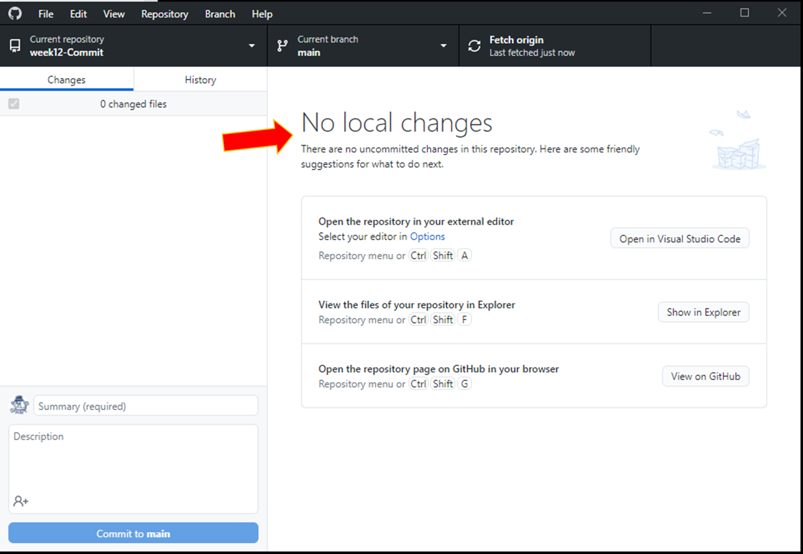
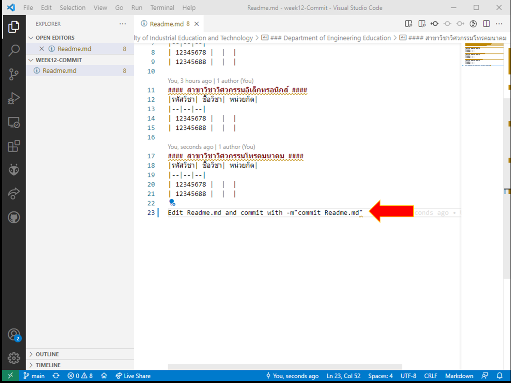
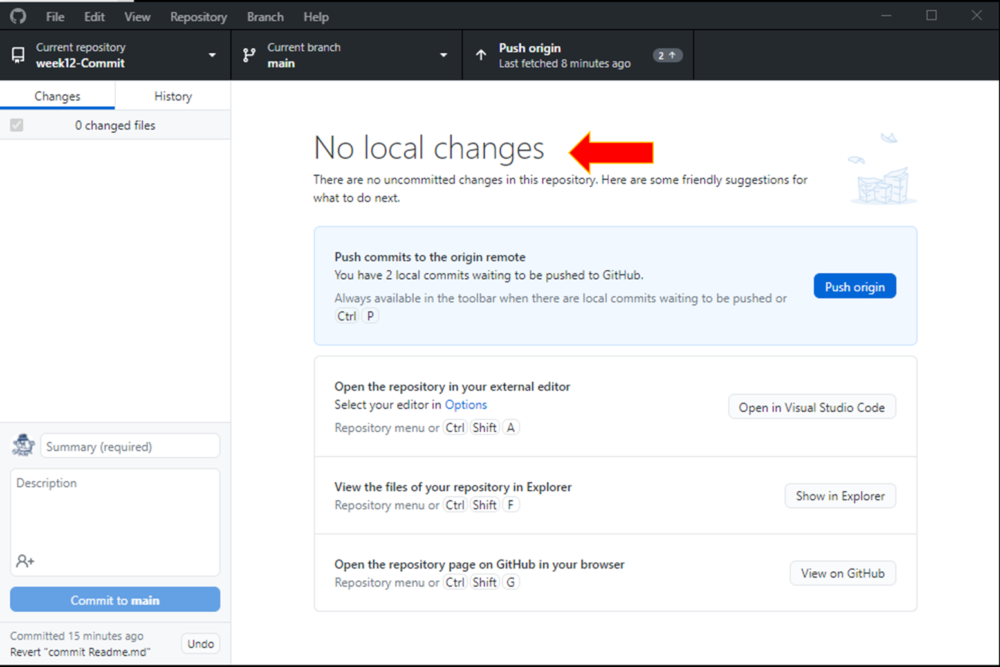

# การทดลองสัปดาห์ที่ 12 #
# เจาะลึกการใช้งาน git #


---
### อุ๊ย ผิดแล้ว ทำไงดี ###

บ่อยครั้งที่เราแก้ไขงานแล้วผิดไปเยอะ อยากได้ของเดิมคืนมา จะให้ git ช่วยยังไงดี
git ช่วยได้หลายขั้นตอนเลย
1. ยกเลิกการแก้ไฟล์ก่อนที่จะ staging ด้วยคำสั่ง ```git add``` 
2. ยกเลิกการแก้ไฟล์ก่อนที่จะ commit ด้วยคำสั่ง ```git commit```
3. ยกเลิกการ commit

### ขั้นตอนการทดลอง ###

## 1. ยกเลิกการแก้ไขไฟล์ที่ยังไม่ทำการ ```git add``` ###


1. ทำการ fork  [https://github.com/ComputerLab1-2564/week12-Commit](https://github.com/ComputerLab1-2564/week12-Commit)  มาไว้ใน account ของตนเอง
2. ใช้ git bash ทำการ clone มาไว้ที่เครื่อง (```git clone <Repository URL>```) หรือ clone ด้วย github desktop แล้วเปิด git bash ในภายหลังก็ได้
3. ดูใน git bash ให้แน่ใจว่าอยู่ที่ branch ชื่อ main *(บางระบบจะตั้งชื่อ branch หลักว่า master)*  ถ้าอยู่ที่ branch อื่่นๆ ให้ใช้คำสั่ง ```git checkout <main|master>```
4. เปิดโปรแกรม github desktop ขึ้นมา เราจะใช้มันเป็นตัวแสดงความแตกต่างของไฟล์ 
5. แก้ไขไฟล์ Readme.md ด้วย editor ที่ชอบ **แล้วบันทึกไฟล์**


6. ใน github desktop จะแสดงเนื้อหาส่วนที่ถูกแก้ไข


7. ใน git bash ให้ทำการตรวจสอบสถานะ โดยคำสั่ง ```git status```


8. ถ้าต้องการยกเลิกการเปลี่ยนแปลงที่ทำกับ Readme.md ให้ใช้คำสั่ง ```git checkout Readme.md``` **ระวังเรื่องการใช้ตัวพิมพ์เล็ก/พิมพ์ใหญ่ในชื่อไฟล์ด้วย**


8.1 


สิ่งที่แก้ไข จะถูกไฟล์ที่อยู่ใน local repository เขียนทับไปแล้ว และกลับเป็นเหมือนเดิมก่อนมีการแก่ไขไฟล์นั้น
**ถ้าเป็น source code ที่มีการแก้ไขจนเกิดการผิดพลาดที่หลายตำแหน่ง วิธีนี้จะช่วยกู้คืนงานเราได้**
**ควร commit บ่อยๆ เพราะว่าเวลากู้คืนจะไม่เสียเวลางานมาก**

**ควร commit เฉพาะงานที่ work เพราะว่าจะมีประโยชน์มากกว่าการ commit งานที่เสร็จครึ่งๆ กลางๆ เว้นเสียแต่วันนี้ยังทำไม่เสร็จ ต้อง commit ไว้ก่อน**


---
## 2. ยกเลิกการแก้ไขไฟล์หลังทำการ ```git add``` และก่อน ```git commit```###

หลังจากที่เราทำการ add ไฟล์ใดๆ เข้าไปยัง staging area แล้ว มันจะพร้อมสำหรับการ commit และ/หรือ push ไปยัง remote repository
แต่ในบางครั้ง มีบางเหตุผลที่ต้องยกเลิกการ add ไฟล์ เราสามารถทำได้ตามขั้นตอนต่อไปนี้
### ขั้นเตรียมการ ###
1. แก้ไขไฟล์ Readme.md


ตรวจสอบโดย github desktop


2. เพิ่มไฟล์ Readme.md ไปยัง staging area ด้วยคำสั่ง ```git add Readme.md````

3. เช็คสถานะ git ด้วยคำสั่ง ```git status```


จะเห็นว่าคำสั่ง ```git status``` จะมีคำแนะนำบางอย่าง ซึ่งเราสามารถนำมาใช้เพื่อยกเลิกการกระทำขั้นก่อนหน้านี้ได้
### ขั้นแก้ไขปัญหา ###

4. ล้างค่าใน staging area โดยคำสั่ง ```git restore --staged Readme.md"```


5. ยกเลิกการเพิ่มไฟล์เข้าไปใน staging areae ตามขั้นตอนการทดลองในหัวข้อก่อนหน้านี้ หรือทำตามคำแนะนำใน git bash 
(ในขั้นนี้จะลองทำตามที่ git bashบอก คือ ) ```git restore Readme.md```


### ขั้นตรวจสอบผลลัพธ์ ###

6. ตรวจสอบไฟล์ใน editor และ github desktop





---
## 2. ยกเลิกการแก้ไขไฟล์หลังทำการ ```git commit```###

เมื่อเราทำการ commit ไปแล้ว ก็สามารถยกเลิกการ commit ได้เช่นกัน

### ขั้นเตรียมการ ###
1. แก้ไขไฟล์ Readme.md




2. เพิ่ม Readme.md เข้าไปยัง staging area โดยคำสั่ง ```git add Readme.md```
   


3. commit ไฟล์ Readme.md โดยคำสั่ง ```git commit -m "commit Readme.md"```


 


### ขั้นแก้ไขปัญหา ###

4. ยกเลิกการ commit โดยพิมพ์คำสั่ง ```git revert HEAD```
จะปรากฏ text editor ขึ้นมา 
   * ใครเชื่อมไว้กับ text editor ของ OS ก็แก้ไขข้อความบน text editor นั้นได้เลย แต่ถ้าไม่ได้เชื่อมไว้ ต้องแก้บน text editor บน git bash
   * ทำตามคำอธิบายในภาพด้านล่างนี้


5. เมื่อกลับมาจาก text editor จะปรากฏข้อความต่อไปนี้


### ขั้นตรวจสอบผลลัพธ์ ###
6. ตรวจสอบไฟล์ต้นฉบับด้วย text editor และ github desktop





7. ตรวจสอบ history log ด้วยคำสั่ง ```git log --pretty=format:'%h %ad | %s%d [%an]' --date=short```


