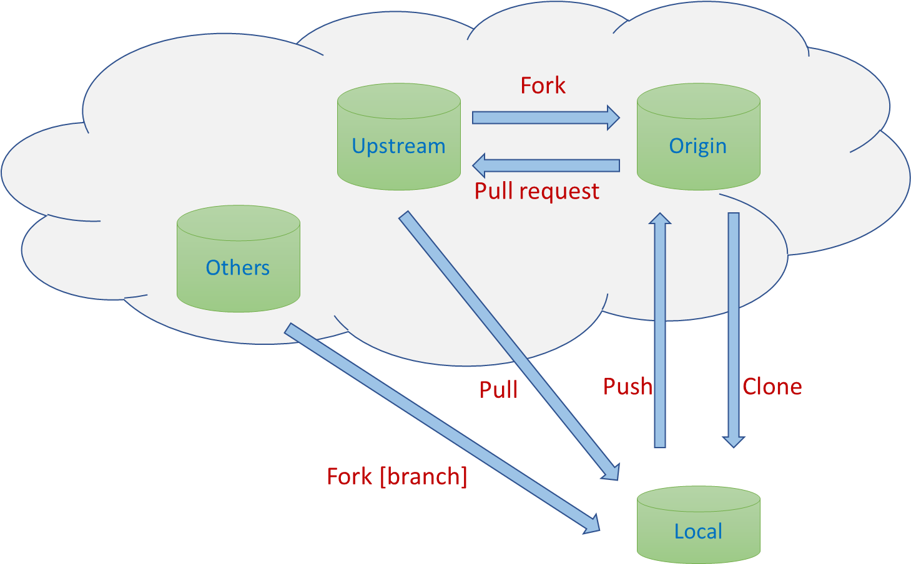

# Git Origin vs Upstream 

ในการทำงานกับ Remote repository นั้น เราจะสามารถทำงานกับ remote repository ได้เป็นจำนวนมาก สามารถเรียกดูได้โดยใช้คำสั่ง

```git
 git remote -v
```

สามารถศึกษาคำสั่ง git remote ทั้งหมดได้จาก [git remote command](https://git-scm.com/docs/git-remote) 

--- 
โดยทั่วไป repository ที่เราสามารถใช้งานบน server นั้นจะมี 3 รูปแบบคือ




### 1. Origin repository ###
Origin repository เป็น repository ที่เราสร้างใน account ของตนเองบน server ซึ่งอนุญาติให้ทำงานได้ทุกรูปแบบ ทั้งการ ```clone```, ```push```, ```pull```, merge ฯลฯ


### 2. Upstream repository ###
Upstream repository เป็น repository ของผู้ใช้รายอื่น หรือของ organization ต่าง ๆ (รวมถึง organization ที่เราเป็นสมาชิกอยู่ด้วย) 

Repository ลักษณะนี้จะอนุญาตให้เราทำการ fork มาไว้ใน account ของเรา หรือ  ```pull``` มายัง local repository บนเครื่องคอมพิวเตอร์ของเราได้ แต่จะไม่สามารถใช้คำสั่ง push ได้ เนื่องจาก upstream repository มักจะเป็น repo ของผู้ใช้รายอื่นที่ไม่ได้ให้สิทธิ์เราในการเขียน

ถ้าหาก upstream repository นั้นอยู่ใน organization ของเราหรือเจ้าของให้สิทธิ์เราในการเขียนได้ ก็ต้องทำงานด้วยความระมัดระวัง ไม่ควรทำการ push ขึ้นไปโดยตรง ควรจะถือปฏิบัติให้เป็นมาตรฐานเดียวกันคือ หากเป็น upstream repository ต้องทำการ pull request เท่านั้น

การ pull request คือการแบ่งปันหรือนำเสนองานที่เราปรับปรุงไปยัง upstream repository เป็นการร้องขอให้เจ้าของ upstream repository นำงานของเราไป merge เข้ากับ upstream repository

### 3. Repository ที่เพิ่มเข้ามาเพื่อวัตถุประสงค์อื่นๆ ###
เราสามารถเพิ่ม repository อื่นๆ เข้ามาใน remote repository เพื่อทำงานให้บรรลุวัตถุประสงค์ที่ต้องการได้ เช่น เราสามารถเพิ่ม url ของ repository ที่ต้องการดึงไฟล์เข้ามาบน local repository โดยที่ไม่ได้อยู่ในฐานะ upstream repository ได้ดังนี้ 

```
git remote add fork <url of fork>
git fetch fork
git checkout -b fork_branch fork/<branch>
```

