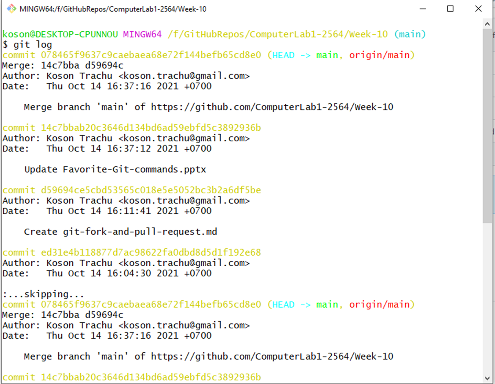

# การทดลองสัปดาห์ที่ 12 #
# เจาะลึกการใช้งาน git #


---
### ดูประวัติการทำงานบน  git ###

การทำงานต่างๆ บน git repository จะถูกบันทึกไว้ใน log เราสามารถเรียกดูด้วยคำสั่ง ```git log```

## ขั้นตอนการทดลอง ##

1. เปิด file explorer ของ repository 
ในใบงานนี้ จะใช้ repository ของ [ใบงานที่ 10](https://github.com/ComputerLab1-2564/Week-10)

#### _ส่วนของนักศึกษา เพื่อให้เห็นการทำ branch ให้เลือก repository ที่ทำ MyTranscript ในการทดลองที่แล้ว_ ####


2.  เรียก  git bash command line โดยการคลิกขวาตรงพื้นที่ว่าง เลือก ```Git bash here```


3.  ให้สังเกตุว่าในหน้าต่าง git bash จะต้องแสดง path ไปยังที่ตั้งของ repository และมีชื่อ branch ปัจจุบันในวงเล็บ


### ดูประวัติด้วยคำสั่ง git log ###

4.  พิมพ์คำสั่ง  ```git log``` หน้าจอจะแสดงคล้ายตัวอย่างนี้ 
   


   - ให้ capture หน้าจอนักศึกษามาวางในใบงาน
   **_คำแนะนำ_** ถ้าประวัติมีความยาวมาก ที่บรรทัดสุดท้าย จะมีเครื่องหมาย colon  ```:``` แสดงว่าระบบยังแสดงประวัติไม่หมด ให้เคาะ space bar ไปจนกว่าจะหมดข้อความ (มีคำว่า ```(END)```) ตรงนี้เมื่อกดปุ่มใดๆ จะไม่มีการตอบสนอง ให้กด ```Shift``` ค้างไว้และกดปุ่ม ```z``` สองครั้ง  


### ดูประวัติบรรทัดเดียว (one line history) ###

จากข้อ 4 จะเห็นว่าระบบมีการแสดงข้อความของแต่ละ commit ออกมาเป็นจำนวนมาก 

เราสามารถสั่งให้แสดงแต่ละ commit เพียงบรรทัดเดียวได้

5. พิมพ์คำสั่ง  ```git log --pretty=oneline``` หน้าจอจะแสดงคล้ายตัวอย่างนี้ 


   - ให้ capture หน้าจอนักศึกษามาวางในใบงาน
   **_คำแนะนำ_** ถ้าข้อความล้นบรรทัด ระบบจะปัดลงมา ทำให้ดูลำบาก สามารถปรับความกว้างของ git bash ให้มากขึ้น แล้ว พิมพ์คำสั่ง  ```git log --pretty=oneline``` อีกครั้ง

   

### ควบคุมการดูประวัติบรรทัดเดียว (one line history) แบบต่าง ๆ ###
เราสามารถควบคุมให้ ```git log --pretty=oneline``` แสดงผลในรูปแบบที่กำหนดได้ เช่น

___แสดงเพียง 2 commit___

```git
    git log --pretty=oneline --max-count=2
```

___แสดงประวัตินับจาก 5 นาทีที่แล้ว___
```
    git log --pretty=oneline --since='5 minutes ago'
```
**_คำแนะนำ_** สามารถเปลี่ยน ```minutes``` เป็นหน้วยเวลาอื่นๆ เช่น ```days```


___แสดงประวัติจนถึง 5 นาทีที่แล้ว___

```git log --pretty=oneline --until='5 minutes ago'```
**_คำแนะนำ_** สามารถเปลี่ยน ```minutes``` เป็นหน้วยเวลาอื่นๆ เช่น ```days```


___แสดงประวัติตามชื่อผู้ commit___

```git log --pretty=oneline --author=<your name>```


___แสดงประวัติทั้งหมด___
```git log --pretty=oneline --all```


**_คำแนะนำ_** ดูคำสั่ง ``git log`` ทั้งหมดได้โดยการพิมพ์  ```git log --help```


## _ให้นักศึกษาทดลองคำสั่งข้างบน แล้ว capture หน้าจอมาส่ง โดยแทรกใต้คำสั่งในตัวอย่าง_ ##


### ปรับแต่งการแสดงผล  ###
   
พิมพ์คำสั่งต่อไปนี้ (ครั้งละคำสั่ง) สังเกตุผลที่ได้ บันทึกผลและอธิบาย

1.  ```git log --pretty=format:'%h'```
 
 
 

2.  ```git log --pretty=format:'%h %ad'```
 
 
 

3.  ```git log --pretty=format:'%h %ad' --date=short```
   
   

4.  ```git log --pretty=format:'%h %ad' --date=short```


5.  ```git log --pretty=format:'%h %ad | %s%d' --date=short```


6.  ```git log --pretty=format:'%h %ad | %s%d [%an]' --date=short```


7.  ```git log --pretty=format:'%h %ad | %s%d [%an]' --date=short --graph```


#### รูปแบบคำสั่งควบคุมการแสดงผล ####

```git
--pretty="..." defines the format of the output.
    %h is the abbreviated hash of the commit
    %d are any decorations on that commit (e.g. branch heads or tags)
    %ad is the author date
    %s is the comment
    %an is the author name
--graph informs git to display the commit tree in an ASCII graph layout
--date=short keeps the date format nice and short 
